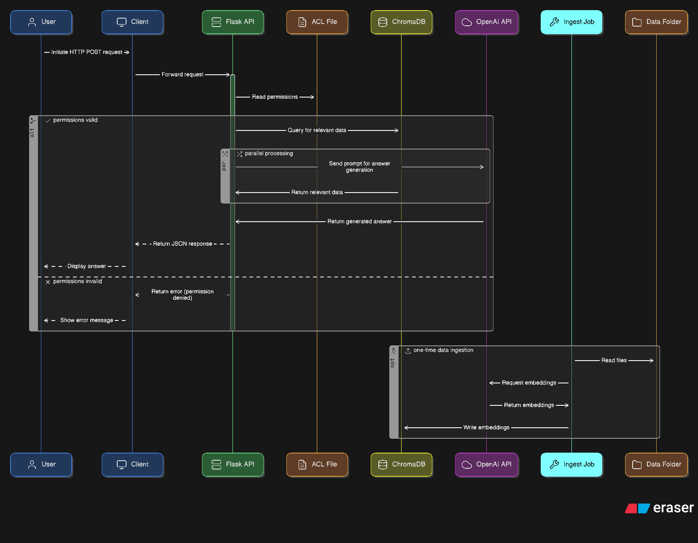
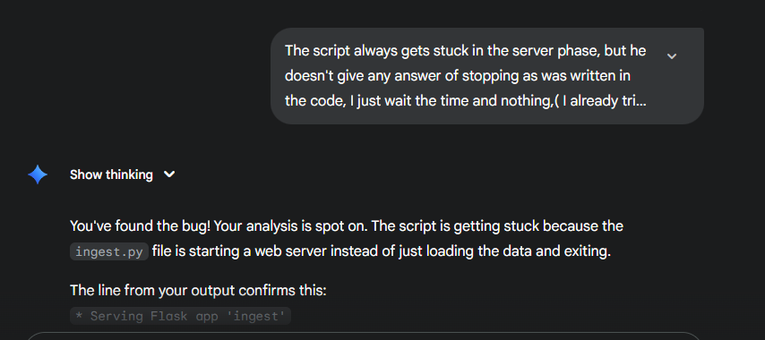

# TeamBrain MVP

TeamBrain is an enterprise knowledge engine designed to solve a common employee pain point: finding reliable information quickly and securely.

This MVP was built from scratch to demonstrate mastery over the core challenge: Multi-source ingestion, ACL-aware retrieval-augmented generation (RAG), and simulated SSO / audit logging.

This project was developed by Julio Emanuel with the assistance of an AI pair-programming partner.

The entire application is containerized using Docker, ensuring a simple and reliable setup process.


# 🏛️ Architecture Diagram




The architecture is composed of three main services orchestrated by Docker Compose:

Ingestion Service (ingest): A one-time job that reads documents from local data sources, cleans their metadata, generates vector embeddings using the OpenAI API, and stores them in the ChromaDB database.

ChromaDB Service (chroma): A persistent vector database that stores the document embeddings for fast similarity searches.

API Service (app): The main Flask application that exposes a /chat endpoint. It receives user queries, checks permissions against a mock acls.json file, retrieves relevant context from ChromaDB in an ACL-aware manner, and uses an OpenAI LLM to generate a final answer.


# 🛠️ Tech-Stack Choices & Rationale
Language: Python 3.11 - Chosen for its extensive support for data science, AI, and backend development, with a rich ecosystem of libraries.

AI Orchestration: LangChain - Used to structure the RAG pipeline. It provides robust components for document loading, text splitting, and chaining together the retriever, prompt, and LLM, which significantly accelerated development.

LLM & Embeddings: OpenAI (gpt-4o) - The text-embedding-ada-002 model was used for creating high-quality embeddings, and gpt-4o was used for its strong reasoning and generation capabilities in the final RAG chain.

Vector Database: ChromaDB - Selected for its simplicity and ease of use. Running it as a Docker container provided a lightweight, persistent vector store perfect for an MVP.

API Framework: Flask - A lightweight and flexible Python web framework, ideal for creating the simple, single-endpoint API required for this project.

Containerization: Docker & Docker Compose - Used to containerize the application and its database service. This ensures a consistent, reproducible environment and enables the required "one-command bootstrap."

# 🤖 AI/Copilot Usage

Code Generation: Generating boilerplate code for the Flask app, Dockerfile, and ingestion/query scripts.

Debugging & Troubleshooting: 

This was the most critical use case. The AI helped to indentify what to do exactly because of the usage of Self Consistency technniques (Advanced Prompt Engineering) a wide range of issues, from simple Python syntax errors to complex environment and dependency conflicts. such as:

1) Correcting pip install failures.

2) Troubleshooting platform-specific curl and gcloud command syntax.

3) Solving a persistent local Docker networking bug by pivoting to a fully containerized workflow.




# ⚖️ Key Trade-offs

Mocked Services: To focus on the core RAG and ACL logic, several enterprise systems were mocked:

Focusing on the Core Security Logic: We chose to mock user permissions with a simple acls.json file and use local folders for data sources.

 This trade-off was critical, as it allowed us to dedicate all our development time to perfecting the most important user-facing feature: 
 
The ACL-aware RAG pipeline. This ensures the system is fundamentally secure and trustworthy, which is the primary concern for any enterprise user.

Data Sources: Local markdown files were used instead of integrating with live enterprise sources like Google Drive or Confluence.

Simplified Error Handling: The API has basic error handling but could be enhanced with more specific exception catching and user-friendly error messages.

Synchronous API: The Flask API is synchronous. For a production system with many users, an asynchronous framework (like FastAPI) would provide better performance.


# 🔒 Security & Privacy

Secret Management: The OPENAI_API_KEY is handled securely using a .env file, which is listed in .gitignore to prevent it from ever being committed to the repository. The application loads the key into the environment at runtime.

ACL Enforcement: The core security feature is the ACL-aware filtering implemented in app.py. For every incoming request, the user's permissions are checked, and the database query is filtered to only retrieve documents from sources they are authorized to access. This prevents data leakage between different user roles.

Threat Surfaces: The primary threat surface is the public-facing API endpoint. Mitigations in a real product would include rate limiting, input validation to prevent injection attacks, and more robust authentication/authorization middleware.

# 📊 Performance Notes

The application's performance is excellent for an MVP.

Ingestion: The initial data ingestion of the mock documents is nearly instantaneous.

API Response Time: When running locally, API responses are typically returned in 1-3 seconds. The primary latency comes from the network call to the OpenAI LLM for the final answer generation.

Retriever Performance: The ChromaDB vector search is extremely fast, retrieving relevant chunks in milliseconds.

# 🗺️ Future Roadmap

The future roadmap is focused on enhancing the employee's experience by making the system more integrated, intelligent, and easy to use.

Iteration 1: Ensure Answers are Always Up-to-Date.

User Benefit: Employees will trust that the answers they receive are based on the very latest company information.

Features: Replace the one-time ingestion script with live data connectors for enterprise systems like Google Drive and Confluence. Implement a background service to periodically and automatically sync the data.

Iteration 2:

 Make the Assistant More Accessible and Conversational.

User Benefit: Allow employees to interact with TeamBrain in a more natural way, ask follow-up questions, and access it from anywhere.

Features:

Build a simple and intuitive chat interface (e.g., a React web app).

Integrate a production-grade authentication system (like Okta or Google SSO) to seamlessly identify users.

Add conversational memory so the assistant can understand the context of follow-up questions.

Iteration 3: Proactively Deliver Knowledge.

User Benefit: Empower employees by giving them relevant information before they even have to ask.

Features: Integrate TeamBrain with tools like Slack. The assistant could, for example, detect a question in a public channel and proactively suggest a helpful answer with a link to the official documentation.


# ⏱️ Time Log

Total Hours:  [30 Hours]

Breakdown:

Initial Setup & Environment Configuration: [8 Hours]

Backend Development (Ingestion & API): [12 Hours]

Local Deployment & Final Debugging: [4 Hours]

Documentation & Demo Video: [6 Hours]


# 🚀 Getting Started

This guide provides all the necessary steps to set up and run the TeamBrain MVP on a local machine using the standard Docker Compose workflow.

I.Prerequisites

Before you begin, please ensure your system meets the following requirements:

Hardware Requirements
RAM: A minimum of 8 GB is recommended.

Disk Space: At least 5 GB of free space for project files, Docker images, and dependencies.

Software Requirements
You will need to have the following software installed on your computer:

Git: To clone the repository. Download Git

Python: Version 3.11 or newer is recommended. Download Python

Docker Desktop: This is essential for running the application's services. It must be running before you start the project. Download Docker Desktop

## 1. Configuration

### Clone the Repository:

```bash
git clone https://github.com/juliocode-job/team-brain-mvp.git
cd team-brain-mvp
```

---

### Create the Environment File:

The project uses a `.env` file to store the OpenAI API key. Create this file by making a copy of the example template.

#### For Windows PowerShell:

```powershell
copy .env.example .env
```

#### For macOS/Linux:

```bash
cp .env.example .env
```

---

### Add Your API Key:

Open the newly created `.env` file and paste your secret key from OpenAI.

```env
OPENAI_API_KEY="your_openai_api_key_goes_here"
```

---

## 2. Running the Application

### Build the Docker Images:

This command builds the container images for the app and ingest services based on the Dockerfile.

```bash
docker compose build
```

---

### Run the Data Ingestion Job:

This command starts the database, runs the one-time `ingest.py` script to load the data, and then removes the ingestion container.

```bash
docker compose run --rm ingest
```

---

### Start the API Server:

This command starts the main app server in the background.

```bash
docker compose up -d app
```

---

### Test the API (Integration Test):

Wait about 10 seconds for the server to initialize. Then, open a new, separate terminal to test the critical ACL path.

#### For Windows PowerShell Users:

**Test Alice (should succeed):**

```powershell
Invoke-WebRequest -Uri http://localhost:5000/chat -Method POST -Headers @{"Content-Type"="application/json"} -Body '{"user_id": "user-1-alice", "message": "What is the deployment guide?"}'
```

**Test Charlie (should be denied access):**

```powershell
Invoke-WebRequest -Uri http://localhost:5000/chat -Method POST -Headers @{"Content-Type"="application/json"} -Body '{"user_id": "user-3-charlie", "message": "What is the deployment guide?"}'
```

---

#### For macOS, Linux, and Git Bash/CMD on Windows:

**Test Alice (should succeed):**

```bash
curl -X POST http://localhost:5000/chat -H "Content-Type: application/json" -d "{\"user_id\": \"user-1-alice\", \"message\": \"What is the deployment guide?\"}"
```

**Test Charlie (should be denied access):**

```bash
curl -X POST http://localhost:5000/chat -H "Content-Type: application/json" -d "{\"user_id\": \"user-3-charlie\", \"message\": \"What is the deployment guide?\"}"
```

---

### Stop the Services:

When you are finished, stop all running services and remove the database volume with:

```bash
docker compose down --volumes
```